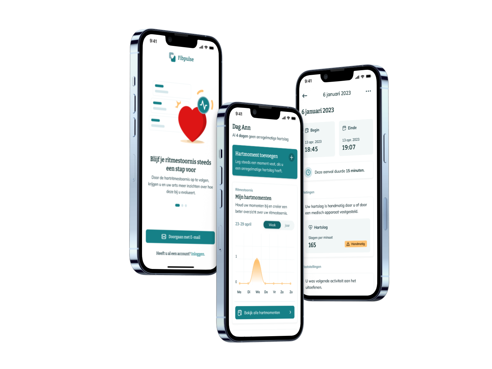

<div id="top"></div>

<br />
<div align="center">
  
</div>

<details>
  <summary>Table of Contents</summary>
  <ol>
    <li>
      <a href="#tracking-your-heart-disorder-with-fibpulse">Short introduction</a>
      <ul>
        <li><a href="#build-with">Build with</a></li>
      </ul>
    </li>
    <li>   <a href="#try-it-out">Try it out</a></li>
    <li>
      <a href="#installation">Installation</a>
      <ul>
        <li><a href="#prerequisites">Prerequisites</a></li>
        <li><a href="#database-setup">Database setup</a></li>
        <li><a href="#local-development">Local development</a></li>
        <li><a href="#building-the-app">Building the app</a></li>
      </ul>
    </li>
    <li><a href="#created-by">Created by</a></li>

  </ol>
</details>

## Tracking your heart disorder with Fibpulse

<p align="center">
  
</p>

Currently, 1 in 4 people face the risk of heart disorders beyond their 40s, we recognize that heart health is a crucial component of overall well-being. At Fibpulse, we are committed to empowering you with the tools you need to actively monitor and manage heart conditions, with a special focus on atrial fibrillation.

Your heart deserves the best care, and informed decisions lead to better outcomes. Fibpulse allows you to export your heart health data with ease, empowering you to have productive discussions with your heart specialist. Armed with this valuable information, you and your doctor can work together to devise the most effective care plan.

We believe in the strength of community support. Let's prioritize heart health together and embrace healthier lifestyles as we support one another on this journey. With Fibpulse, you're not just a passive observer, you become an active participant in your heart's wellness, fostering a stronger and happier life.

Start prioritizing heart health with Fibpulse today.

<br />

### Build with

The following technologies and frameworks were used in the development of this project:

- [React Native](https://reactnative.dev/)
- [Expo](https://expo.io/)
- [Supabase](https://supabase.com/)
- [NativeWind](https://nativewind.dev/)

<br />

## Try it out

### Expo Go

One way to test Fibpulse, is to download the Expo Go app on your phone and scan the QR code below or click on the link.

<p align="center">
  
</p>

[Open Fibpulse in Expo Go app](exp://u.expo.dev/a32b5503-7a1e-40e7-ad8f-e958348387ee?channel-name=main&runtime-version=exposdk%3A48.0.0)

### User

    Email: milanbauwens@outlook.be
    Password: secret123

<br />

## Installation

### Prerequisites

- [Node.js](https://nodejs.org/en/)
- [An existing Expo account](https://expo.dev/)

### Database setup

#### Sign in or Sign up

Go to [Supabase](https://supabase.com) and sign in to your account. If you don't have an account, sign up for a new one.

#### Create a new project

Once you're logged in, create a new project by clicking the **New project** button Give your project a name and fill in the other required information. Then, click the **Create new project** button.

> **Important:** Always choose the region closest to you.

#### Adding tables

Click on the **Database** section, and press the **New table** button.

You should create tables for the following:

- medical_profiles
- discover
- episodes

Add the following columns to the tables:

##### medical_profile

| Column            | Type   |                                                                  |
| ----------------- | ------ | ---------------------------------------------------------------- |
| user_id           | uuid   | Foreign key from auth.users.id as Primary Key + enable cascading |
| gender            | text   |                                                                  |
| risk_factors      | text[] |                                                                  |
| episode_frequency | text   |                                                                  |
| passed_intake     | bool   | Default FALSE                                                    |
| heart_disorder    | text   |                                                                  |
| episode_duration  | text   |                                                                  |
| year_of_birth     | int8   |                                                                  |

##### discover

| Column   | Type |                    |
| -------- | ---- | ------------------ |
| id       | int8 | Primary Key        |
| category | text |                    |
| title    | json | {"en":"", "nl":""} |
| content  | json | {"en":"", "nl":""} |
| source   | text |                    |

##### episodes

| Column              | Type        |                                                 |
| ------------------- | ----------- | ----------------------------------------------- |
| id                  | int8        | Primary Key                                     |
| user_id             | uuid        | Foreign key on auth.users.id + enable cascading |
| start_data          | timestamptz |                                                 |
| end_date            | timestamptz |                                                 |
| pulse               | int8        |                                                 |
| is_medical_approved | bool        | Default FALSE                                   |
| activity            | text        |                                                 |
| symptoms            | text[]      |                                                 |
| notes               | text        |                                                 |

Save your tables by clicking the **Save** button.

#### Locate your API Keys

Click on the **Project settings** section, and press the **API** button.

You should see your API keys. Copy the **anon** key, **service_rol** key and the **URL**. You will need these in the next steps to setup your environment variables.

### Local Development

Clone the repository.

```sh
git clone https://github.com/milanbauwens/fibpulse.git
```

Change to the directory.

```sh
cd fibpulse
```

Install NPM packages

```sh
npm install
```

Copy the `.env.example` file to `.env` and fill in the required information.

```sh
cp .env.example .env
```

> This is where you API keys from Supabase come in.

Start the app on an emulator or your phone through the Expo Go app.

```sh
npx expo start
```

### Building the app

To build the app, please follow the instructions on the [Expo documentation](https://docs.expo.dev/distribution/building-standalone-apps/).

<br />

## Created by

Milan Bauwens - [@milanbauwens](https://www.milanbauwens.be)
